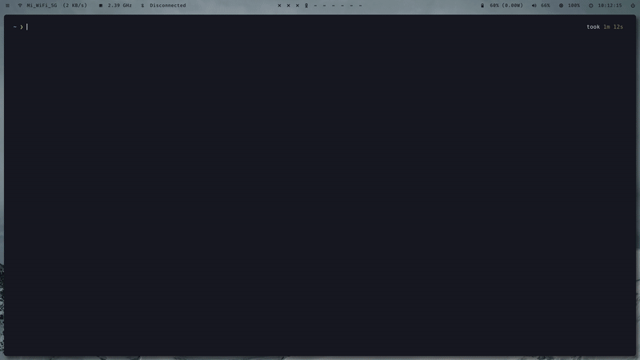
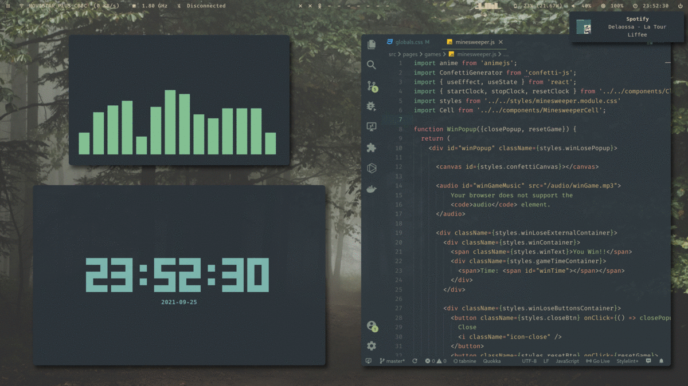

# Gtheme
A bash script that makes your theming life so much easier 🎨.

## What is this?

Based in patterns, Gtheme can generate any file applying one of the more than 350 themes gathered.  
Thus, it can create and replace in real time a rofi colors.rasi file, an alacritty.yml file and so much more, leading
to a global theme change perception that we all really need.

**But that's not all...**  
With the latest update, Gtheme can also raplace your config files with the ones provided delivering a one click desktop change and a plug and play experience ready to enjoy the script. You can also create and store your own desktops following the few rules described below.  

It also supports:
* Executing a post script to, for example, restart the dunst notification daemon or refresh the terminal colors with tput.
* Changing the wallpaper to match your new color scheme.
* Changing the Visual Studio Code theme.

### Demo



## Installation

Just clone the repository and run the installer.

**Be patient when cloning the repo, there are so many top wallpapers included!**
```
git clone https://github.com/daavidrgz/gtheme.git gtheme
cd gtheme
./install.sh
```

After that you can now run `gtheme` and apply your first desktop.  
**Keep in mind that some of your config files will be replaced. Make sure you have done a backup before proceeding!**

***

## Wiki

### Desktops **(New)**

* Every desktop is stored in the `desktops/` folder.

* Inside, you'll find everything you need to get that desktop running fine. There must be:
	* A `.config/` folder which **will replace all the folders in common** with the user's config ones located in `$HOME/.config`.
	* A `gtheme/` folder with the patterns and post-scripts to apply  

	You can also store another files inside your desktop folder (gtheme will ignore them) like in [japan](https://github.com/daavidrgz/gtheme/tree/master/desktops/japan).

### Themes

* All themes are stored in the `themes/` folder with the `.colors` extension.  

* In those files are stored all the colors of each theme, but it can also contain: (see [Nord.colors](https://github.com/daavidrgz/gtheme/tree/master/themes/Nord.colors))
	* A Visual Studio Code theme `vscode: Your Theme Name`<sup>[1](#vscode_theme)</sup><sup>[2](#vscode_theme_2)</sup>
	* A wallpaper `wallpaper: /path/to/wallpaper/wp.jpg`

### Patterns

* All patterns are stored in the `desktops/{desktop_name}/patterns/` folder with the `.pattern` extension.  
If you want to activate a pattern, just use the `-a` option in the program or create a symlink to the pattern in the `desktops/{desktop_name}/patterns/active-patterns/` folder.

* **Mandatory key**: `%output-file%=/output/path/file.extension`  
It's required to know where to place the file generated, its name and extension.

* Available keys: `%background%` `%foreground%` `%cursor%` `%selection-background%` `%selection-foreground%` `%black%` `%black-hg%` `%red%` `%red-hg%` `%green%` `%green-hg%` `%yellow%` `%yellow-hg%` `%blue%` `%blue-hg%` `%magenta%` `%magenta-hg%` `%cyan%` `%cyan-hg%` `%white%` `%white-hg%`.

* The program will scan the pattern and replace the keys with the associated color in the theme.<sup>[3](#no_color)</sup>

### Post-Scripts

* The scripts will be stored in the `desktops/{desktop_name}/post-scripts/` folder with the `.sh` extension.  

* The script files **with the same name as the pattern** will be executed after the output file is generated.   

* The created file's path is sent to all the scripts as its first argument (see [kitty.sh](https://github.com/daavidrgz/gtheme/tree/master/desktops/simple/gtheme/post-scripts/kitty.sh)). 

* The `wallpaper.sh` is a special type of post-script that is called when there is a wallpaper specified in the theme.  
	The first argument recieved by the script will be the new wallpaper's url; the second specifies if the wallpaper should be applied to your DM and the third whether your wallpaper will be themed or no using [ImageTheming](https://github.com/daniel-seiler/ImageTheming). (see [wallpaper.sh](https://github.com/daavidrgz/gtheme/blob/master/desktops/simple/gtheme/post-scripts/wallpaper.sh) for an example).  
	Because of feh generates a script with the last wallpaper you set as background in `~/.fehbg`, you can now reference it to set the theme's wallpaper after
	every boot.

* There are also two new special scripts that gtheme tries to use with the last update.
	* `desktop-start.sh`: It's executed every time a desktop is changed. You can set a default palette, wallpaper, etc... using it. A simple example:
		```
		#!/bin/sh
		gtheme -n Snazzy -vw
		```
	* `desktop-exit.sh`: It's executed before the new desktop is applied and should not be empty.
	You can use it to restart your WM. If you're using bspwm:
		```
		#!/bin/sh
		bspc quit
		exit $?
		```


***

### Examples using the "Simple" desktop



## Credits

Wallpaper repositories:
* https://github.com/elementary/wallpapers
* https://github.com/rose-pine/wallpapers
* https://github.com/linuxdotexe/nordic-wallpapers
* https://github.com/dracula/wallpaper
* https://gitlab.com/exorcist365/wallpapers

## Notes

<a name="vscode_theme">1. - </a>The VSCode theme won't be installed automatically.  
<a name="vscode_theme_2">2. - </a>You may need to change the vscode settings.json file location in the script's global settings section.  
<a name="no_color">3. - </a>If there is no color associated to a key in a theme, it will be replaced with an empty string in the output file.
